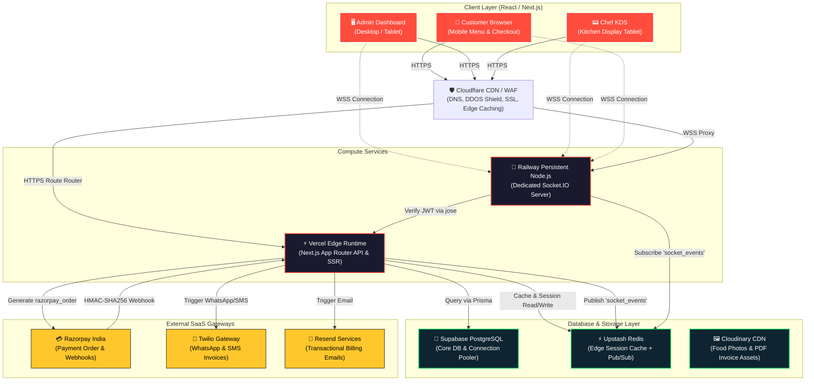
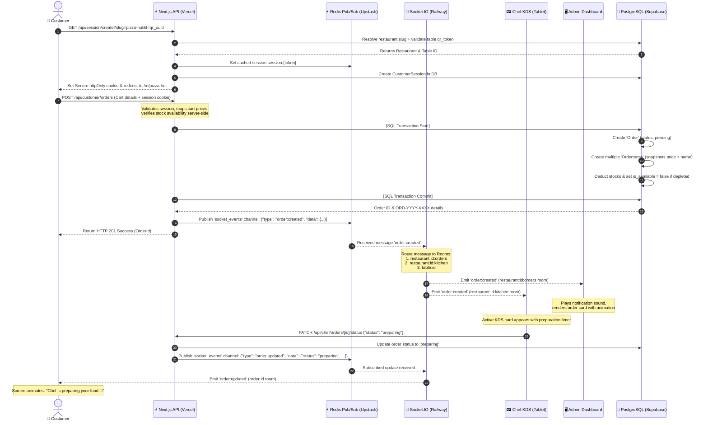
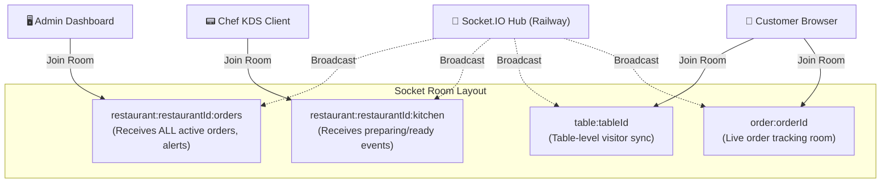
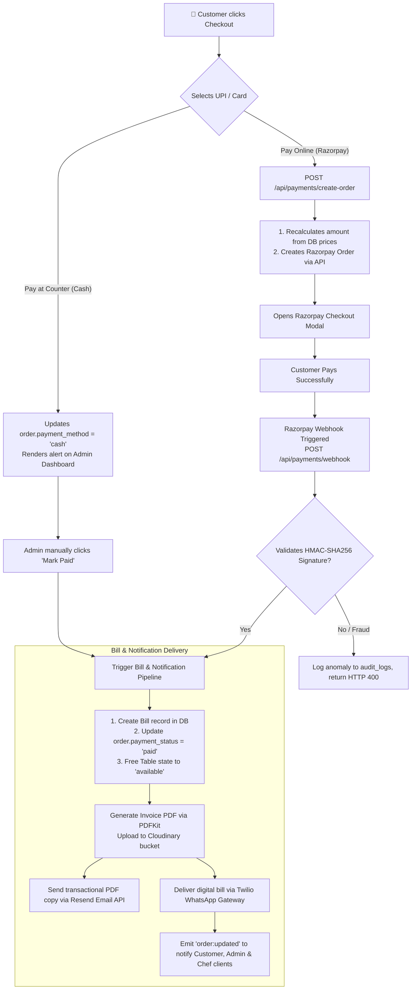

# ScanBite (QR Dine) — Complete Architecture & End-to-End Connectivity Master Guide

ScanBite (QR Dine) is a state-of-the-art **multi-tenant B2B SaaS** restaurant operating system. It enables physical dining tables to be digitalized through unique QR codes. Customers can scan a table's QR code to browse a high-performance animated menu, place orders, complete checkout via digital payments, and track their preparation live—without downloading any app or logging in. 

Behind the scenes, restaurant admins manage menus, layout configurations, orders, billing, and metrics in real-time from a desktop dashboard, while chefs manage active orders via a Kitchen Display System (KDS).

This document serves as the absolute **source of truth** for ScanBite's cloud topology, system design, database entities, real-time networking, and complete API endpoint maps.

---

## 1. High-Level Cloud Deployment Topology

ScanBite is built on a modern, decoupled serverless-and-microservices architecture designed for extreme responsiveness, cost-efficiency, and seamless horizontal scaling.



### Infrastructure Deep-Dive
*   **Vercel (Edge & Serverless API Routes)**: Hosts the main Next.js App Router codebase. Serverless APIs are distributed globally at edge points, ensuring rapid response times for customer page loads and administrative CRUD operations.
*   **Railway (Dedicated Socket.IO Server)**: WebSockets are inherently stateful and persistent. Because serverless functions (like Vercel API routes) cannot support open WebSocket connections, a persistent Node.js instance on Railway handles active connections, rooms, and stateful broadcasts.
*   **Upstash Redis (Edge Cache & Pub/Sub Bridge)**: Serves two roles:
    1.  **Session & Menu Cache**: Acts as an ultra-fast in-memory cache for customer sessions and menu structures to avoid database roundtrips.
    2.  **Pub/Sub Event Bus**: When Vercel serverless routes update database state (e.g., creating an order), they publish an event to Redis. The stateful Railway Socket.IO server subscribes to Redis, receives the event instantly, and forwards it to the active browser clients.
*   **Supabase PostgreSQL (Transactional Database)**: Holds the relational database engine. Multi-tenancy isolation is enforced logically on every SQL statement.

---

## 2. Dynamic Order Lifecycle & Real-Time Sync

The following sequence details how state transitions flow when a customer places an order, demonstrating the integration of **PostgreSQL Transactions, Redis Pub/Sub, and Socket.IO Rooms**.



---

## 3. Database Entity Relationship & Multi-Tenant Model

ScanBite uses a **logical multi-tenancy model**. A single database instance serves all tenants. Tenant-scoped tables are logically isolated via a `restaurant_id` column which is fully indexed.

```mermaid
erDiagram
    RESTAURANT ||--o{ USER : "has employees"
    RESTAURANT ||--o{ RESTAURANT_TABLE : "manages"
    RESTAURANT ||--o{ MENU_CATEGORY : "categorizes"
    RESTAURANT ||--o{ MENU_ITEM : "serves"
    RESTAURANT ||--o{ ORDER : "receives"
    RESTAURANT ||--o{ BILL : "collects"
    RESTAURANT ||--o{ CUSTOMER_SESSION : "has active visitors"
    RESTAURANT ||--o{ LOYALTY_ACCOUNT : "tracks customers"
    RESTAURANT ||--o{ COUPON : "offers discounts"
    RESTAURANT ||--o{ AUDIT_LOG : "records edits"

    RESTAURANT_TABLE ||--o{ CUSTOMER_SESSION : "hosts"
    RESTAURANT_TABLE ||--o{ ORDER : "places"
    
    MENU_CATEGORY ||--o{ MENU_ITEM : "contains"
    
    MENU_ITEM ||--o{ ITEM_CUSTOMIZATION : "supports"
    MENU_ITEM ||--o{ ORDER_ITEM : "ordered_in"
    
    CUSTOMER_SESSION ||--o{ ORDER : "owns"
    
    ORDER ||--o{ ORDER_ITEM : "consists_of"
    ORDER ||--o1 BILL : "billed_via"
    
    LOYALTY_ACCOUNT ||--o{ LOYALTY_TRANSACTION : "accumulates"

    RESTAURANT {
        UUID id PK
        String name
        String slug UK
        String logo_url
        String brand_color
        Decimal cgst_rate
        Decimal sgst_rate
        PlanType plan
        Boolean is_active
        Boolean onboarded
        DateTime created_at
    }

    USER {
        UUID id PK
        UUID restaurant_id FK
        String name
        String email
        String password_hash
        String pin_hash
        UserRole role
        Boolean is_active
    }

    RESTAURANT_TABLE {
        UUID id PK
        UUID restaurant_id FK
        String table_number
        Int capacity
        TableStatus status
        UUID qr_token UK
    }

    CUSTOMER_SESSION {
        UUID id PK
        UUID restaurant_id FK
        UUID table_id FK
        UUID session_token UK
        DateTime expires_at
    }

    MENU_CATEGORY {
        UUID id PK
        UUID restaurant_id FK
        String name
        Int sort_order
        Boolean is_active
    }

    MENU_ITEM {
        UUID id PK
        UUID restaurant_id FK
        UUID category_id FK
        String name
        Decimal price
        FoodType food_type
        Boolean is_available
        Int stock_quantity
        Int low_stock_threshold
    }

    ITEM_CUSTOMIZATION {
        UUID id PK
        UUID menu_item_id FK
        UUID restaurant_id FK
        String name
        Json options
        Boolean is_required
    }

    ORDER {
        UUID id PK
        UUID restaurant_id FK
        UUID table_id FK
        UUID session_id FK
        String order_number
        OrderStatus status
        PaymentStatus payment_status
        PaymentMethod payment_method
        String notes
        Boolean bill_requested
        String razorpay_order_id
    }

    ORDER_ITEM {
        UUID id PK
        UUID order_id FK
        UUID menu_item_id FK
        UUID restaurant_id FK
        String item_name
        Decimal item_price
        Int quantity
        Json customizations
    }

    BILL {
        UUID id PK
        UUID order_id FK "unique"
        UUID restaurant_id FK
        String bill_number UK
        Decimal subtotal
        Decimal cgst
        Decimal sgst
        Decimal discount
        Decimal total
        Boolean is_printed
    }
```

### Logical Tenant Security Helper (`lib/tenant.ts`)
To prevent data leakage across different restaurants, every single prisma request is run through a tenant scoping validator:

```typescript
export function tenantScope(restaurantId: string) {
  if (!restaurantId) throw new Error('CRITICAL: Missing restaurant_id — tenant isolation breach')
  return { restaurant_id: restaurantId }
}

// Example usage inside Menu query API:
const menuItems = await prisma.menuItem.findMany({
  where: {
    ...tenantScope(restaurantId),
    is_available: true
  }
});
```

---

## 4. Complete API Endpoint Connectivity Matrix

Below is the definitive listing of all **37 REST endpoints** mapped out inside `app/api`, classifying authorization, request logic, database changes, and real-time triggers.

### Auth, Onboarding & Setup Endpoints

| Endpoint | Method | Authentication | Scope/Description | DB Modifications | Real-time Socket Event |
| :--- | :---: | :--- | :--- | :--- | :--- |
| `/api/auth/[...nextauth]` | `GET/POST` | Public | NextAuth middleware hook | None | None |
| `/api/auth/signup` | `POST` | Public | Super-admin / initial admin account sign up | Inserts `users` (admin) | None |
| `/api/auth/chef-login` | `POST` | Public | Chef validation using role and numeric PIN | Reads `users`, signs session JWT | None |
| `/api/admin/onboarding` | `POST` | Session | Create and link restaurant details | Inserts `restaurants` | None |
| `/api/restaurant/setup` | `POST` | Session (Admin) | Initial database configuration & seed tables | Seed `menu_categories`, `restaurant_tables` | None |

### Customer (Mobile Menu) Endpoints

| Endpoint | Method | Authentication | Scope/Description | DB Modifications | Real-time Socket Event |
| :--- | :---: | :--- | :--- | :--- | :--- |
| `/api/session/create` | `GET/POST` | QR Token | Initiates customer session via Table QR Code | Inserts `customer_sessions`, writes httpOnly Cookie | None |
| `/api/public/menu/[slug]` | `GET` | Public | Fetches menu cached via Redis for instant load | None | None |
| `/api/customer/orders` | `POST` | Cookie (Customer) | Validates cart, stock, and creates a dining order | Inserts `orders`, `order_items`; updates `menu_items` stock | Emits `order:created` to rooms `restaurant:id:orders`, `restaurant:id:kitchen` |
| `/api/customer/orders` | `GET` | Cookie (Customer) | Fetches order history linked to session | None | None |
| `/api/customer/orders/[id]/status` | `GET` | Cookie (Customer) | Live status tracking endpoint for customer | None | None |
| `/api/customer/orders/[id]/bill` | `POST` | Cookie (Customer) | Requests a digital bill for the table | Updates `orders` (bill_requested: true) | Emits `order:updated` |
| `/api/customer/bills/split` | `POST` | Cookie (Customer) | Calculates custom split fractions for table bills | None | None |

### Chef (Kitchen Display) Endpoints

| Endpoint | Method | Authentication | Scope/Description | DB Modifications | Real-time Socket Event |
| :--- | :---: | :--- | :--- | :--- | :--- |
| `/api/chef/orders/[id]/status` | `PATCH` | JWT (Chef / Admin) | Transition order status (confirmed ➔ preparing ➔ ready) | Updates `orders.status` | Emits `order:updated` to rooms `restaurant:id:orders`, `restaurant:id:kitchen`, `order:id` |

### Admin Dashboard Endpoints

| Endpoint | Method | Authentication | Scope/Description | DB Modifications | Real-time Socket Event |
| :--- | :---: | :--- | :--- | :--- | :--- |
| `/api/admin/analytics` | `GET` | JWT (Admin) | Returns aggregated metrics, low stocks, and sales | None | None |
| `/api/admin/inventory` | `GET/PATCH` | JWT (Admin) | Manage real-time stock levels, warnings | Updates `menu_items.stock_quantity` | None |
| `/api/admin/settings` | `GET/PATCH` | JWT (Admin) | Manage restaurant logo, colors, GST taxes | Updates `restaurants` | None |
| `/api/admin/staff` | `GET/POST/DELETE`| JWT (Admin) | CRUD waiters and chefs staff logins | Inserts/Updates/Deletes `users` | None |
| `/api/admin/orders/manual` | `POST` | JWT (Admin/Waiter) | Enables manual ordering from waiter tablets | Inserts `orders`, `order_items` | Emits `order:created` |
| `/api/admin/orders/[id]/status` | `PATCH` | JWT (Admin) | Direct override of order status/cancellations | Updates `orders` | Emits `order:updated` |
| `/api/admin/bills` | `GET` | JWT (Admin) | Retrieve complete invoice listings | None | None |
| `/api/admin/bills/[id]` | `GET` | JWT (Admin) | Retrieve specific invoice details | None | None |
| `/api/admin/bills/[id]/invoice` | `GET` | JWT (Admin) | Generates and fetches Invoice PDF document | None | None |
| `/api/admin/bills/[id]/send` | `POST` | JWT (Admin) | Manually re-trigger WhatsApp & Email receipt | None | None |

### Table & Asset Endpoints

| Endpoint | Method | Authentication | Scope/Description | DB Modifications | Real-time Socket Event |
| :--- | :---: | :--- | :--- | :--- | :--- |
| `/api/tables` | `GET/POST` | JWT (Admin) | List physical tables & add new dining spaces | Inserts `restaurant_tables` | None |
| `/api/tables/[id]` | `PATCH/DELETE` | JWT (Admin) | Edit table details, reset QR codes, delete tables | Updates/Deletes `restaurant_tables` | None |
| `/api/upload` | `POST` | JWT (Admin) | Gets Cloudinary signed presets for client upload | None | None |

### Menu Management (CRUD) Endpoints

| Endpoint | Method | Authentication | Scope/Description | DB Modifications | Real-time Socket Event |
| :--- | :---: | :--- | :--- | :--- | :--- |
| `/api/menu/categories` | `GET/POST` | JWT (Admin) | View and create food categories (e.g. Desserts) | Inserts `menu_categories` | None |
| `/api/menu/categories/[id]`| `PATCH/DELETE` | JWT (Admin) | Edit categories, update sort index, delete | Updates/Deletes `menu_categories` | None |
| `/api/menu/items` | `GET/POST` | JWT (Admin) | Create menu items and catalog them | Inserts `menu_items` | None |
| `/api/menu/items/[id]` | `PATCH/DELETE` | JWT (Admin) | Edit individual food price, description, status | Updates/Deletes `menu_items` | None |
| `/api/menu/items/[id]/customizations` | `GET/POST/DELETE` | JWT (Admin) | Configure size variations, add-ons groups | Inserts/Updates/Deletes `item_customizations` | None |

### Payment Gateway Endpoints

| Endpoint | Method | Authentication | Scope/Description | DB Modifications | Real-time Socket Event |
| :--- | :---: | :--- | :--- | :--- | :--- |
| `/api/payments/create-order`| `POST` | Cookie (Customer) | Initiates online Razorpay order (amounts checked server-side)| Updates `orders.razorpay_order_id` | None |
| `/api/payments/verify` | `POST` | Cookie (Customer) | Verifies client signature immediately after popup | Updates `orders` (payment_status: paid) | Emits `order:updated` |
| `/api/payments/webhook` | `POST` | Signature Check | Absolute payment confirmation (Razorpay to Server) | Creates `bills`, marks `orders` paid, resets table | Emits `order:updated` to all rooms |
| `/api/health` | `GET` | Public | System status health-check endpoint | None | None |

---

## 5. Socket.io Real-Time Networking Model

ScanBite maintains a structural room configuration where clients are placed instantly upon establishing connection. 

### Room Routing Architecture



### Handshake & Authentication Sequence
1.  **Customer Handshake**:
    *   `auth: { role: 'customer', restaurantId: '...', tableId: '...', orderId: '...' }`
    *   No JWT required. Placed immediately into room `table:tableId` and `order:orderId`.
2.  **Admin / Chef Handshake**:
    *   `auth: { token: 'JWT_STRING', role: 'admin|chef' }`
    *   Verified against `process.env.AUTH_SECRET` inside the stateful socket gateway.
    *   Admins enter room `restaurant:restaurantId:orders`.
    *   Chefs enter room `restaurant:restaurantId:kitchen`.

---

## 6. Payment, Invoice & Notification Pipelines

The processing of payments represents a crucial data chain where security, compliance, and user feedback connect.



---

## 7. Caching and Invalidation Matrix

To achieve sub-second FCP (First Contentful Paint) targets on mobile menus while maintaining database stability, Upstash Redis acts as a high-speed caching buffer.

*   **Public Menu Cache (`menu:{restaurantId}`)**:
    *   **TTL**: 5 Minutes.
    *   **Populated by**: Public GET `/api/public/menu/[slug]`.
    *   **Invalidated by**: Admin adding, editing, or deleting a category or item.
*   **Customer Session Cache (`session:{token}`)**:
    *   **TTL**: 2 Hours.
    *   **Populated by**: Table QR code session initialization.
    *   **Invalidated by**: Customer requesting checkout payment completion.
*   **Restaurant Profile Cache (`restaurant:{slug}`)**:
    *   **TTL**: 1 Hour.
    *   **Populated by**: Loading branding config (colors, logo, GST rates).
    *   **Invalidated by**: Admin updating restaurant configuration settings.

---

> [!NOTE]
> All monetary operations are stored using the `Decimal` numeric type (mapped to standard PostgreSQL `DECIMAL(10,2)`) to prevent floating-point calculation drift. Server-side tax computations (CGST/SGST) are strictly locked to the restaurant settings configuration in the database, ignoring user-supplied tax figures.

> [!IMPORTANT]
> The database schema enforces cascade deletions. Deleting a `Restaurant` tenant systematically purges all corresponding `menu_items`, `restaurant_tables`, `customer_sessions`, and historical `orders` automatically, preventing orphaned rows.
