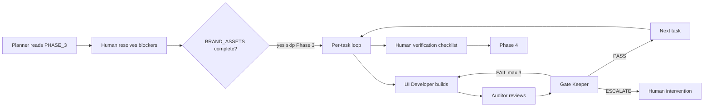
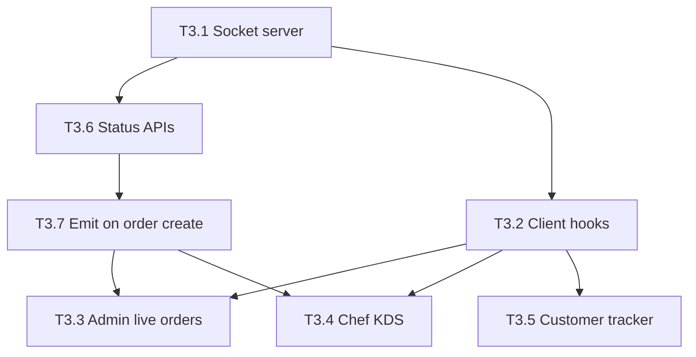

# QR Dine — PHASE 3: Real-Time Engine

> **Goal:** Orders flow in real-time: customer places → admin sees instantly → chef KDS gets card → chef marks ready → customer tracker updates live. Zero page refreshes.
> **Timeline:** Week 5
> **Brand Scout:** NOT required — reuse Phase 2 `BRAND_ASSETS.md`. KDS is functional UI; admin dashboard uses existing design tokens.
> **Codebase:** [`qrdine/`](../../../qrdine/) (Next.js app, no `src/` prefix)

---

## Read Order (Before Any Code)

```
1. qrdine-context/CLAUDE.md              → Immutable rules (multi-tenancy, real-time)
2. .context/ARCHITECTURE.md              → §4 Order lifecycle, §7 Real-time architecture
3. THIS FILE                             → Phase 3 tasks + acceptance
4. .context/pipelines/COMBINED_PIPELINE.md → Agent loop (Build → Audit → Gate)
5. .context/agents/UI_DEVELOPER.md       → Code patterns
6. .context/agents/AUDITOR.md            → Audit checklist
7. .context/agents/GATE_KEEPER.md        → Pass/fail rules
```

---

## Pre-Conditions

```
Phase 2 complete:
  ✓ Orders can be created via customer menu (POST /api/customer/orders)
  ✓ Menu items exist in DB
  ✓ Admin dashboard shell rendered at /dashboard/*
  ✓ Customer order page exists at /m/[slug]/order/[orderId]

Brand Scout:
  ✓ BRAND_ASSETS.md status = COMPLETE (from Phase 2 — no re-interview)
```

---

## Pipeline Execution (COMBINED_PIPELINE)

Every task in this phase follows the unified agent pipeline from [COMBINED_PIPELINE.md](../pipelines/COMBINED_PIPELINE.md).



| Step | Agent / Actor | Action |
|------|---------------|--------|
| 1 | **Planner** | Read this file → confirm task order + surface blockers |
| 2 | **Human** | Resolve blockers below → reply `done` |
| 3 | **Brand Scout** | **SKIP** — Phase 2 brand assets carry forward |
| 4 | **UI Developer → Auditor → Gate Keeper** | For each task 3.1–3.7 (max 3 fix loops per task) |
| 5 | **Human** | Run completion checklist → reply `verified` |
| 6 | — | Proceed to [PHASE_4.md](./PHASE_4.md) |

**Per-task pipeline template:**

```text
Pipeline: UI Developer builds → Auditor (AUDITOR.md) → Gate Keeper (GATE_KEEPER.md)
Gate outcomes: PASS | PASS WITH NOTES | FAIL (max 3 loops) | ESCALATE
```

---

## Human Blockers (Resolve FIRST)

```
🛑 HUMAN ACTION REQUIRED — before Task 3.1
━━━━━━━━━━━━━━━━━━━━━━━━━━━━━━━━━━━━━━━━

1. Environment variables in qrdine/.env.local:
   - NEXT_PUBLIC_SOCKET_URL=http://localhost:3001  (dev)
   - REDIS_URL or UPSTASH_REDIS_REST_URL (same Redis for pub/sub + adapter)

2. Start Socket.IO server (separate terminal):
   cd qrdine/socket-server && npm install && npm run dev
   → Confirm: "Socket.IO listening on port 3001"

3. Start Next.js app:
   cd qrdine && pnpm dev
   → Confirm: http://localhost:3000 loads

4. Three-client test setup:
   - Browser A: /dashboard/orders (admin logged in)
   - Browser B: /kds (chef logged in)
   - Browser C or phone: /m/{slug}?t={qrToken} → place order

Reply "done" when all four are ready.
━━━━━━━━━━━━━━━━━━━━━━━━━━━━━━━━━━━━━━━━
```

---

## Architecture Decision: Socket.IO on Railway

```
WHY Socket.IO (not Supabase Realtime):
  - Custom rooms, Redis pub/sub adapter, horizontal scaling on Railway
  - KDS needs push < 50ms — not polling or DB triggers
  - Games (future) need table-scoped low latency

DEPLOYMENT:
  - Socket.IO: separate Node process (qrdine/socket-server/) on Railway
  - Next.js: Vercel — API routes publish to Redis; never hold WebSocket in serverless
  - Redis: Upstash — channel socket_events + @socket.io/redis-adapter

DATA FLOW (ARCHITECTURE.md §7):
  API route → Prisma update → emitSocketEvent() → Redis publish("socket_events")
  → socket-server subscriber → io.to(room).emit(...)
```

---

## Event & Room Contract (Canonical)

> **Source of truth for agents.** Implemented names differ from older ARCHITECTURE draft (`order:new` → `order:created`, `order:status_updated` → `order:updated`).

### Rooms

| Room | Who joins | Purpose |
|------|-----------|---------|
| `restaurant:{restaurantId}` | Admin, Chef | Broad restaurant scope |
| `restaurant:{restaurantId}:orders` | Admin | Live order feed |
| `restaurant:{restaurantId}:kitchen` | Chef | KDS feed |
| `table:{tableId}` | Customer (at table) | Table-scoped events |
| `order:{orderId}` | Customer (tracking) | Order-specific status updates |

Join logic: [`qrdine/socket-server/rooms.ts`](../../../qrdine/socket-server/rooms.ts)

### Events

| Event | Direction | Emitter | Target rooms |
|-------|-----------|---------|--------------|
| `order:created` | Server → client | API via Redis pub/sub | `:orders`, `:kitchen`, `table:{tableId}` |
| `order:updated` | Server → client | Status PATCH APIs | `:orders`, `:kitchen`, `table:{tableId}`, `order:{orderId}` |
| `order:item_ready` | Server → client | Chef item toggle (optional) | `:orders`, `order:{orderId}` |

| Event | Direction | Notes |
|-------|-----------|-------|
| `order:new` | Internal / Redis | Payload shape = `order:created`; not emitted to browsers |
| `order:status` | Client → server | Guarded; production uses API + Redis only |
| `order:item_status` | Client → server | Chef role only; prefer REST for persistence |

Shared TypeScript: [`qrdine/types/socket.ts`](../../../qrdine/types/socket.ts) (mirrors `socket-server/types.ts`)

---

## Task Dependency Graph



**Build order:** 3.1 → 3.6 → 3.7 → 3.2 → (3.3 ∥ 3.4 ∥ 3.5)

---

## Task Breakdown

### TASK 3.1 — Socket.IO Server Setup

| Field | Value |
|-------|-------|
| **Type** | Backend |
| **Agent** | UI Developer |
| **Depends on** | Human blockers resolved |
| **Architecture** | §7 Real-time, CLAUDE.md Real-Time rules |
| **Implementation** | ✅ Exists in `qrdine/socket-server/` |

**Pipeline:** UI Developer → Auditor → Gate Keeper

```
FILES (qrdine/):
  socket-server/index.ts        → Entry, Redis subscriber on socket_events
  socket-server/auth.ts         → JWT / session auth on connection
  socket-server/rooms.ts        → joinRoomsForSocket, emitOrderCreated/Updated
  socket-server/events.ts       → order:new, order:status, order:item_status handlers
  socket-server/types.ts        → Typed ServerToClientEvents / ClientToServerEvents
  socket-server/package.json
  socket-server/tsconfig.json

SERVER SETUP:
  - PORT 3001 (or Railway PORT)
  - CORS: localhost:3000 + production NEXTAUTH_URL origin
  - @socket.io/redis-adapter on Upstash/ioredis
  - Auth handshake:
      admin  → restaurant:{id}:orders (+ restaurant:{id})
      chef   → restaurant:{id}:kitchen (+ restaurant:{id})
      customer → table:{tableId} + order:{orderId}

ACCEPTANCE:
  □ Socket server starts: cd socket-server && npm run dev
  □ Admin client joins restaurant:{id}:orders
  □ Chef client joins restaurant:{id}:kitchen
  □ Customer joins table:{tableId} and order:{orderId}
  □ Cross-restaurant events NOT received
  □ Invalid/missing auth → connection rejected
  □ Redis adapter connected (logs confirm)
```

---

### TASK 3.2 — Socket.IO Client Hooks

| Field | Value |
|-------|-------|
| **Type** | Frontend |
| **Agent** | UI Developer |
| **Depends on** | Task 3.1 |
| **Architecture** | §7, CLAUDE.md (never trust client status on load) |
| **Implementation** | ✅ Exists |

**Pipeline:** UI Developer → Auditor → Gate Keeper

```
FILES (qrdine/):
  lib/socket.ts              → Singleton io() client, connectSocket / disconnectSocket
  hooks/useSocket.ts         → React hook: status connected | connecting | disconnected
  hooks/useOrderUpdates.ts   → admin | chef | customer modes, order:created/updated

SOCKET CLIENT:
  - NEXT_PUBLIC_SOCKET_URL (default http://localhost:3001)
  - auth payload: { role, restaurantId, token?, tableId?, orderId? }
  - Auto-reconnect with backoff (socket.io-client defaults)
  - Cleanup on unmount

USAGE:
  // Admin orders
  useOrderUpdates({ mode: "admin", restaurantId, token, initialOrders })

  // Chef KDS
  useOrderUpdates({ mode: "chef", restaurantId, initialOrders })

  // Customer — prefer useSocket + order:updated on tracker page
  useSocket({ role: "customer", restaurantId, tableId, orderId })

ACCEPTANCE:
  □ useSocket connects on mount when auth provided
  □ useOrderUpdates upserts orders on order:created / order:updated
  □ Connection status available for UI banners
  □ Reconnects after disconnect without full page reload
```

---

### TASK 3.3 — Admin Live Orders Dashboard

| Field | Value |
|-------|-------|
| **Type** | Frontend |
| **Agent** | UI Developer |
| **Depends on** | Tasks 3.2, 3.7 |
| **Architecture** | §4 steps 7–8 (admin confirms order) |
| **Implementation** | ✅ Mostly complete |

**Pipeline:** UI Developer → Auditor → Gate Keeper

```
FILES (qrdine/):
  app/(dashboard)/dashboard/orders/page.tsx   → Server: load initial orders, pass to feed
  components/orders/OrderFeed.tsx             → Kanban columns + socket + sound
  components/orders/AdminOrderCard.tsx        → Card + inline detail modal
  components/orders/OrderStatusActions.tsx    → Accept / reject / advance status
  components/orders/OrdersHeader.tsx          → Sound mute toggle
  components/orders/OrderDetailModal.tsx      → Full order detail (extracted from card)

LAYOUT:
  Desktop: columns — New (pending) | Active (confirmed+preparing) | Ready | Done
  Mobile: tabs for same groupings

STATUS TRANSITIONS (admin):
  pending → confirmed | cancelled (reason required)
  confirmed → preparing
  preparing → ready (usually chef; admin allowed)
  ready → served

REAL-TIME:
  - order:created → new card in Pending + chime
  - order:updated → card moves column (Framer Motion layout)
  - Page refresh → SSR initial orders + socket overlay

SOUND:
  - New order: Web Audio chime (or public/sounds/new-order.mp3 if added)
  - Overdue preparing: visual amber >15m, red >20m on card border

ACCEPTANCE:
  □ Orders appear in real-time without refresh
  □ New order plays sound (when unmuted)
  □ Accept/reject pending orders works
  □ Status change animates card between columns
  □ Order detail modal: all items, notes, cancellation reason, actions
  □ Elapsed time on each card
  □ Overdue highlighting (amber ≥15m, red ≥20m)
  □ Sound toggle in header
  □ Mobile tabs work
  □ Multi-tenant: only JWT restaurant_id orders
```

---

### TASK 3.4 — Chef Kitchen Display System (KDS)

| Field | Value |
|-------|-------|
| **Type** | Frontend |
| **Agent** | UI Developer |
| **Depends on** | Tasks 3.2, 3.7 |
| **Architecture** | §4 steps 9–10 |
| **Implementation** | ✅ Mostly complete |

**Pipeline:** UI Developer → Auditor → Gate Keeper

```
FILES (qrdine/):
  app/(chef)/kds/page.tsx           → Auth-gated KDS entry
  app/(chef)/layout.tsx             → Full-screen chef shell
  components/kds/KDSGrid.tsx        → Grid, socket, sounds, mark ready
  components/kds/KDSOrderCard.tsx   → Timer, color tiers, item checkboxes
  components/kds/KDSItemRow.tsx     → Per-item ready checkbox
  components/kds/KDSHeader.tsx        → Restaurant name, count, mute

KDS CARD:
  ┌─────────────────────────────┐
  │ Table 5     #ORD-0042  12m  │
  │─────────────────────────────│
  │ □ 2× Butter Chicken         │
  │ □ 1× Garlic Naan            │
  │─────────────────────────────│
  │ [      ALL READY →       ]  │
  └─────────────────────────────┘

COLOR (border):
  Green  < 10 min
  Amber  10–20 min
  Red    > 20 min

SOUND:
  - New order: chime on new active card
  - Overdue: repeat every 30s while any order > 20 min (until marked ready/served)
  - All ready: completion chime

ITEM-LEVEL:
  - Checkboxes: UI state on KDS (persistence optional — not in order_items schema)
  - ALL READY → PATCH /api/chef/orders/{id}/status { status: "ready" }
  - Card exits grid on ready

ACCEPTANCE:
  □ KDS after chef login
  □ Only own restaurant orders
  □ New orders appear < 1s via socket
  □ Timer updates every 10s
  □ Color at 10m and 20m thresholds
  □ Item checkboxes toggle locally
  □ ALL READY marks order ready in DB + emits order:updated
  □ Card animates out
  □ Sound on new + repeating overdue (30s interval)
  □ Mute toggle in header
  □ Responsive 2–3 column grid on tablet
  □ Overdue sort to top
```

---

### TASK 3.5 — Customer Live Order Tracker

| Field | Value |
|-------|-------|
| **Type** | Frontend |
| **Agent** | UI Developer |
| **Depends on** | Task 3.2 |
| **Architecture** | §4 steps 8–11, customer auth |
| **Implementation** | ✅ Complete |

**Pipeline:** UI Developer → Auditor → Gate Keeper

```
FILES (qrdine/):
  app/m/[slug]/order/[orderId]/page.tsx   → Tracker route
  components/customer/OrderTracker.tsx    → Progress steps + socket + polling fallback

TRACKER UI:
  Steps: Placed → Confirmed → Preparing → Ready → Served
  - Filled circle + label for completed steps
  - Animated transitions (Framer Motion)
  - Contextual message per status
  - Cancelled: reason display
  - Served: rating prompt link (placeholder OK)

REAL-TIME:
  - useSocket → order:updated for orderId
  - ready → Notification API (with permission)
  - disconnected → "Reconnecting…" banner
  - Fallback: GET /api/customer/orders?id= every 10s

ACCEPTANCE:
  □ Accurate status on load (SSR or GET)
  □ Chef/admin update → tracker updates < 1s
  □ Browser notification on Ready
  □ Cancelled shows reason
  □ Reconnection banner when socket down
  □ Polling fallback every 10s when disconnected
```

---

### TASK 3.6 — Order Status APIs (REST + Emit)

| Field | Value |
|-------|-------|
| **Type** | Backend |
| **Agent** | UI Developer |
| **Depends on** | Task 3.1 |
| **Architecture** | §4, CLAUDE.md (emit AFTER DB write) |
| **Implementation** | ✅ Complete |

**Pipeline:** UI Developer → Auditor → Gate Keeper

```
FILES (qrdine/):
  app/api/customer/orders/[id]/status/route.ts  → GET status (poll fallback)
  app/api/admin/orders/[id]/status/route.ts     → PATCH admin transitions
  app/api/chef/orders/[id]/status/route.ts      → PATCH chef transitions

RULES:
  - tenantScope(restaurant_id) on every query
  - Validate transitions server-side (400 if invalid)
  - 403 if order.restaurant_id ≠ JWT restaurant_id
  - After Prisma update → emitSocketEvent({ type: "order:updated", data })

TRANSITIONS:
  pending   → confirmed | cancelled
  confirmed → preparing | cancelled
  preparing → ready | cancelled
  ready     → served
  served    → (completed — future cron)

ACCEPTANCE:
  □ GET returns status + order payload for customer
  □ PATCH updates DB then emits socket event
  □ Invalid transitions → 400
  □ Cross-tenant → 403/404
  □ Cancelled orders cannot advance
```

---

### TASK 3.7 — Order Creation → Socket Emit

| Field | Value |
|-------|-------|
| **Type** | Backend |
| **Agent** | UI Developer |
| **Depends on** | Tasks 3.1, 3.6 |
| **Architecture** | §4 step 6, §7 Redis pub/sub |
| **Implementation** | ✅ Complete |

**Pipeline:** UI Developer → Auditor → Gate Keeper

```
FILES (qrdine/):
  app/api/customer/orders/route.ts  → POST create order
  lib/socket-emitter.ts             → Redis publish("socket_events", JSON)

FLOW:
  1. POST /api/customer/orders — validate session, recalc prices, create order + items
  2. emitSocketEvent({ type: "order:created", data: { orderId, tableId, items, ... } })
  3. socket-server receives → emitOrderCreated() to :orders, :kitchen, table:{id}
  4. Admin + Chef UIs receive order:created

ACCEPTANCE:
  □ Place order on phone → admin feed < 1s
  □ Same order on KDS < 1s
  □ Chime on admin + chef (if sound on)
  □ Payload matches DB row
```

---

## Implementation Status Summary

| Task | qrdine/ status | Notes |
|------|----------------|-------|
| 3.1 | ✅ Done | `socket-server/*` |
| 3.2 | ✅ Done | `lib/socket.ts`, `hooks/*` |
| 3.3 | ✅ Done | Detail modal in `OrderDetailModal.tsx` |
| 3.4 | ✅ Done | Repeating overdue sound in `KDSGrid.tsx` |
| 3.5 | ✅ Done | Polling + notifications |
| 3.6 | ✅ Done | Admin/chef/customer status routes |
| 3.7 | ✅ Done | `socket-emitter.ts` + customer orders POST |

---

## Phase 3 Completion Checklist

```
HUMAN VERIFICATION:
  □ cd qrdine/socket-server && npm run dev — listening on 3001
  □ cd qrdine && pnpm dev — app on 3000
  □ Browser A: /dashboard/orders (admin)
  □ Browser B: /kds (chef)
  □ Browser C: /m/{slug}?t={token} — place test order
  □ Order appears in A and B within 1 second
  □ Admin accepts → status confirmed on B and C
  □ Chef ALL READY → customer tracker shows Ready
  □ Sound on new order (admin + chef, unmuted)
  □ KDS card red after 20 min; overdue beep every 30s
  □ Disconnect Wi‑Fi on C → reconnection banner + polling
  □ Restaurant A cannot see Restaurant B orders
  □ Refresh admin page → orders reload from DB + socket continues
  □ pnpm build — zero TypeScript errors
  □ Git: tag pre-phase-4, commit "Phase 3 complete"
```

Reply **`verified`** to proceed to Phase 4.

---

## Use Cases Verified

| # | Actor | Action | Expected |
|---|-------|--------|----------|
| 1 | Customer | Places order | Admin + Chef see instantly |
| 2 | Admin | Accepts (pending → confirmed) | KDS + customer tracker update |
| 3 | Admin | Rejects with reason | Customer sees cancellation |
| 4 | Chef | Marks 1 item ready (checkbox) | Checkbox fills on KDS (local UI) |
| 5 | Chef | ALL READY | Order leaves KDS; customer → Ready |
| 6 | Admin | Marks served | Customer → Served + rating prompt |
| 7 | Customer | Loses internet | Reconnection banner; 10s polling |
| 8 | Customer | Returns to tab | GET restores current status |
| 9 | Chef | Order > 20 min | Red card; beep every 30s |
| 10 | Admin | Mutes sound | No chime; visual alerts remain |
| 11 | Two restaurants | Concurrent orders | Isolated feeds |
| 12 | Admin | Refreshes page | SSR orders + live socket |

---

*Real-time is the magic. When a customer sees their order change status without touching anything, that's the "wow" moment. Follow the pipeline — no shortcuts.*
